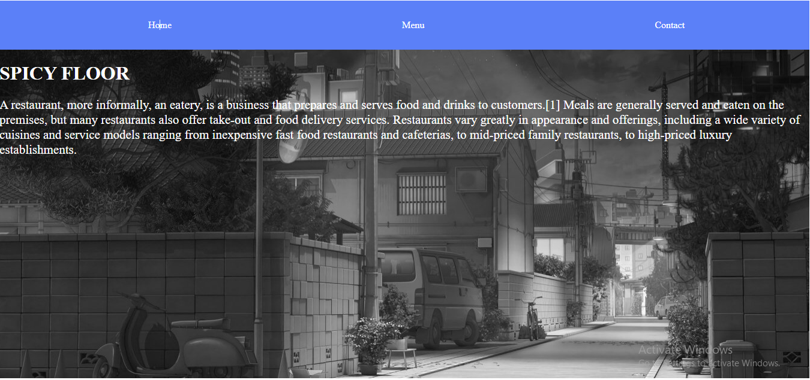
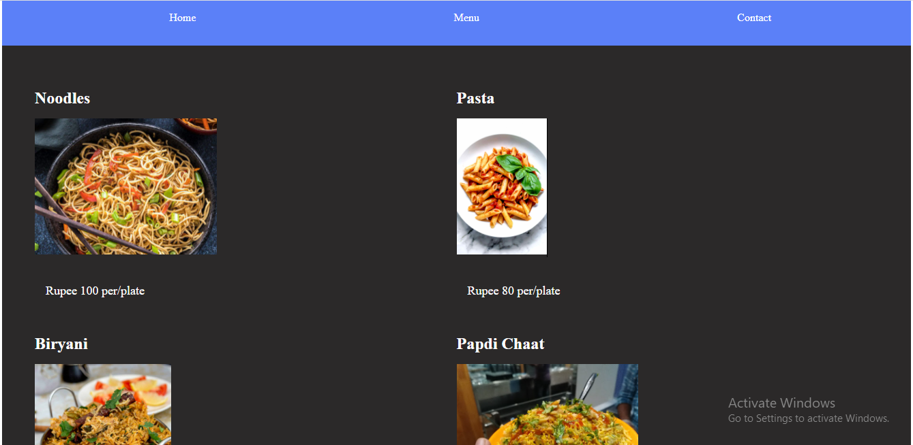
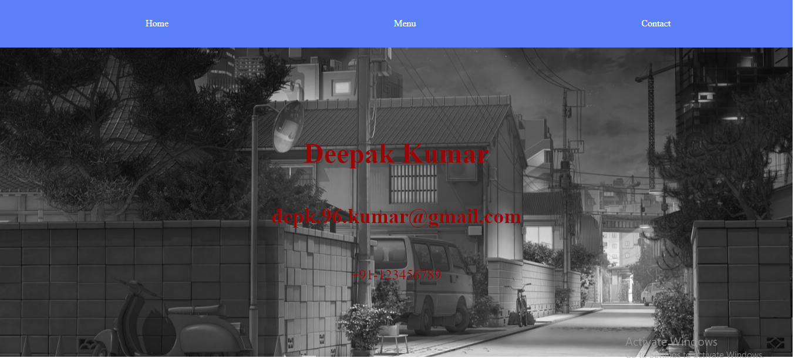

# Restaurant

This project is a small restaurant app created using javascript.Here There is 3 pages home, menu and contact.
      
## 🔧 Built with

- JavaScript
- HTML 5 and CSS 3.

## Project Screenshot








## Live Demo Link

[Live Demo](https://deepakdanger.github.io/Restaurant_page/)


## Getting Started

To get a local copy of the repository please run the following commands on your terminal:

```
$ cd <folder>
```

~~~bash
$ git clone https://github.com/Deepakdanger/Restaurant_page.git
$ cd Restaurant

~~~

## For Webpack

~~~bash

$ npm run build

$ npm run start

~~~


## ✒️  Authors 


👤 **Deepak Kumar**

- Github: [@DeepakKumar](https://github.com/Deepakdanger)


## 🤝 Contributing

Contributions, issues and feature requests are welcome!

Feel free to check the [issues page](https://github.com/Deepakdanger/Restaurant_page/issues).


## 👍 Show your support

Give a ⭐️ if you like this project!

## :clap: Acknowledgements

- Microverse: [@microverse](https://www.microverse.org/)

- [The Odin Project](https://www.theodinproject.com/courses/javascript/lessons/restaurant-page)

## 📝 License

This project is [MIT](./LICENSE) licensed.